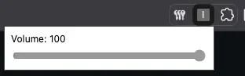

# Instagram Volume Control

Control de volumen para Instagram — una pequeña extensión para ajustar el comportamiento de audio en Instagram Web.

 

## Descripción

Esta extensión inyecta un script en las páginas de Instagram (`https://instagram.com/*`, `https://www.instagram.com/*`) para ofrecer control de volumen desde la interfaz del navegador (popup) y aplicar ajustes persistentes mediante la API de `storage`.

## Archivos principales

- `manifest.json` — Declaración de la extensión (permisos, content scripts, popup).
- `content.js` — Lógica inyectada en las páginas de Instagram.
- `popup.html` — Interfaz del popup de la extensión.
- `popup.js` — Lógica del popup (control de UI y comunicación con `storage`).

## Permisos

La extensión solicita el permiso `storage` en el `manifest.json` para guardar las preferencias de volumen del usuario.

## Instalación (modo desarrollador — Chrome/Edge)

1. Abre `chrome://extensions/` (o `edge://extensions/`).
2. Activa "Modo de desarrollador".
3. Haz clic en "Cargar descomprimida" y selecciona la carpeta del proyecto (la raíz que contiene `manifest.json`).
4. Abre `https://www.instagram.com/` para probar la extensión.

## Uso

- Haz clic en el icono de la extensión para abrir el popup y ajustar el volumen.
- Las preferencias se guardan usando la API de `storage` y se aplican en las páginas de Instagram cuando se carga `content.js`.
